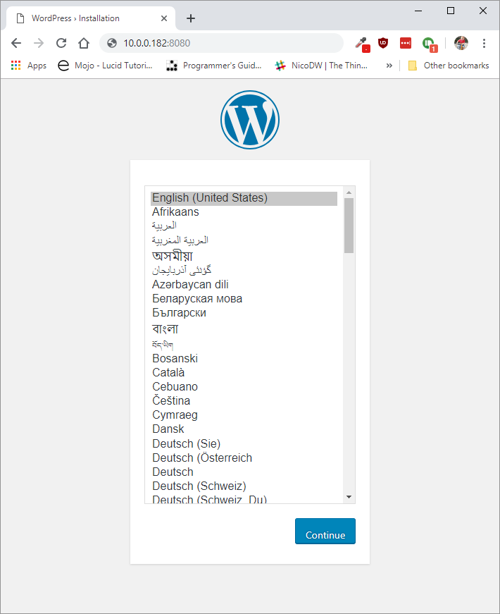

# Running Containers

Running images with Docker can be done using the `docker run` command. The command can take many attributes that supply information on how to run the container. It also allow you to override all defaults set by the image developer, as well as those set by the docker runtime.

To run the well-known `hello-world` image, we can use the following command.

```bash
docker run hello-world:latest
```

::: tip Container Name
Note that docker will give all its containers a random name. It is possible to assign a custom name to a container by providing the `--name` flag with the `docker run` command.
:::

Here `hello-world` is the name of the image and `latest` is the version tag, which allows you to pick a specific version to run a container from.

This will pull the latest image from Docker Hub and spawn a container from it. The container will execute the binary which generates the output. This output is then redirected via the Docker client to your current terminal.

::: tip Docker Hub
Sharing Docker images is made easy by Docker Hub. Anybody can create an account on Docker Hub to distribute images that can be deployed on other systems or by other users. Therefore it will always be the first place we'll check if someone did not do most of the work for us.
:::

## Setting Up a WordPress

WordPress is a free and open-source content management system based on PHP & MySQL. It includes a plugin architecture and a template system. It is most associated with blogging but supports other types of web content including more traditional mailing lists and forums, media galleries, and online stores.

To setup a WordPress, two things are required:

* A database to store all the information (users, pages, configuration, ...)
* The WordPress application itself

Searching on [Docker Hub](https://hub.docker.com) for `WordPress` and `MariaDB` will result in two useful links:

* MariaDB: [https://hub.docker.com/_/mariadb](https://hub.docker.com/_/mariadb)
* WordPress: [https://hub.docker.com/_/wordpress](https://hub.docker.com/_/wordpress)

Both docker images are well-maintained, used a lot. They belong to the list of most downloaded projects on Docker Hub.

### Creating a user-defined network

In terms of Docker, a bridge network uses a software bridge which allows containers connected to the same bridge network to communicate, while providing isolation from containers which are not connected to that bridge network. The Docker bridge driver automatically installs rules in the host machine so that containers on different bridge networks cannot communicate directly with each other.

Advantages compared to the default bridge:

* User-defined bridges provide better isolation and interoperability between containerized applications.
* User-defined bridges provide automatic DNS resolution between containers.
* Containers can be attached and detached from user-defined networks on the fly.
* Each user-defined network creates a configurable bridge.
* Only linked containers on the default bridge network share environment variables.

To create a user-defined network execute the command below. Make sure to pick a unique name for the network that identifies the actual setup.

```shell
docker network create wordpress-network
```

Checkout the results using `docker network ls`.

### Starting a MariaDB container

To start the database container, the following command can be executed:

```shell
docker run /
  --name <container_name> /
  -e MYSQL_ROOT_PASSWORD=<super_secret_password> /
  -e MYSQL_DATABASE=<database_name>
  -d /
  --net=<network> /
  mariadb:latest
```

This instructs docker to create a new container and give it a more recognizable name (instead of the auto-generated ones). It also configures the database password by supplying an environment variable using the `-e` option. The `-d` option instructs docker to run the container in a detached state - in the background in other words. Output from the container is not shown in the current terminal but can only be accessed by using the `docker logs` command.

::: warning Detached State
Do note that the detached state is especially useful when running daemonized processes inside the container. Running the hello-world image in a detached state will not have a lot of meaning. The output is not shown and the container is automatically exitted after finishing the process. You can try it by executing `docker run -d hello-world`. The only output that is shown in the container id. You can however check out the output by invoking the `docker logs <container_id>` command.
:::

So let's fill in the necessary information and run the container:

```shell
docker run /
  --name wordpress-db /
  -e MYSQL_ROOT_PASSWORD=hu5h43534h4334573 /
  -e MYSQL_DATABASE=wordpress /
  -d /
  --net=wordpress-network /
  mariadb:latest
```

It is now possible to execute other commands in the terminal. The container will keep running in the background until it is stopped manually.

Executing a `docker ps` should show the container as up and running:

```shell
CONTAINER ID        IMAGE           COMMAND                  CREATED             STATUS              PORTS               NAMES
50b2754a5dfc        mariadb:latest  "docker-entrypoint.s…"   About an hour ago   Up About an hour    3306/tcp            wordpress-db
```

When inspecting the `wordpress-network` using `docker network inspect wordpress-network`, you should see that the `wordpress-db` container is connected:

```shell
[
  {
    "Name": "wordpress-network",
    ...
    "Containers": {
      "d27f551b6c815bce501db8525f4bca1701d89bf8281a145442841cb2746ee79f": {
          "Name": "wordpress-db",
          "EndpointID": "a8a68edbb1c99233f2fe1a1d8bfa60bc0bd14d0966573b4640804dca962f3a05",
          "MacAddress": "02:42:ac:12:00:02",
          "IPv4Address": "172.18.0.2/16",
          "IPv6Address": ""
      }
    }
    ...
  }
]
```

### Starting WordPress

Once the database is up and running, the WordPress application container can be started. For this we'll need to supply the name of the container running the database, `wordpress-db` in our case and the root password.

```shell
docker run /
  --name my-wordpress /
  -e WORDPRESS_DB_HOST=wordpress-db /
  -e WORDPRESS_DB_USER=root /
  -e WORDPRESS_DB_NAME=wordpress /
  -e WORDPRESS_DB_PASSWORD=hu5h43534h4334573 /
  -p 8080:80 /
  -d /
  --net=wordpress-network /
  wordpress
```

We also need to open the port on which the WordPress is listening to the outside, so we can connect to it from outside the docker environment. For this we map the port of the internal process `80` to a port on our host, namely `8080`. All traffic to port `8080` of the Docker host will be forwarded to port `80` in the container.

### Surfing to the WordPress site

When you surf to the WordPress website using <http://localhost:8080>, you should get the installer screen.



Finish the setup wizard and enjoy your website.

### Docker logs

The containers we created are running in the background in detached mode. We can check output generated by the processes by executing the `docker logs <container>` command.

For example for the `my-wordpress` container this would be `docker logs my-wordpress`. This will output the request already made to the webserver:

```shell
10.0.0.5 - - [10/Mar/2019:16:55:34 +0000] "GET /wp-content/themes/twentynineteen/print.css?ver=1.3 HTTP/1.1" 200 1566 "http://10.0.0.182:8080/" "Mozilla/5.0 (Windows NT 10.0; Win64; x64) AppleWebKit/537.36 (KHTML, like Gecko) Chrome/72.0.3626.121 Safari/537.36"
10.0.0.5 - - [10/Mar/2019:16:55:34 +0000] "GET /wp-content/themes/twentynineteen/style.css?ver=1.3 HTTP/1.1" 200 30317 "http://10.0.0.182:8080/" "Mozilla/5.0 (Windows NT 10.0; Win64; x64) AppleWebKit/537.36 (KHTML, like Gecko) Chrome/72.0.3626.121 Safari/537.36"
10.0.0.5 - - [10/Mar/2019:16:55:34 +0000] "GET /favicon.ico HTTP/1.1" 200 228 "http://10.0.0.182:8080/" "Mozilla/5.0 (Windows NT 10.0; Win64; x64) AppleWebKit/537.36 (KHTML, like Gecko) Chrome/72.0.3626.121 Safari/537.36"
127.0.0.1 - - [10/Mar/2019:16:55:42 +0000] "OPTIONS * HTTP/1.0" 200 126 "-" "Apache/2.4.25 (Debian) PHP/7.2.15 (internal dummy connection)"
10.0.0.5 - - [10/Mar/2019:16:56:32 +0000] "POST /wp-admin/admin-ajax.php HTTP/1.1" 200 512 "http://10.0.0.182:8080/wp-admin/index.php" "Mozilla/5.0 (Windows NT 10.0; Win64; x64) AppleWebKit/537.36 (KHTML, like Gecko) Chrome/72.0.3626.121 Safari/537.36"
```

### Interacting with Running Containers

But what if you needed to check some other logs or something else in the container? In other words, how do we connect to a shell inside the container?

Basically we request docker to spawn a process inside an existing container. For example a `bash` shell:

```shell
docker exec -it my-wordpress bash
```

The `exec` option allows us to run commands against already running containers. `-t` allocates a virtual terminal session within the container, so you can type stuff from your keyboard into the container process. This is commonly used with the option `-i`, which keeps STDIN open even if running in detached mode, because standard only STDOUT and STDERR are kept open.

## Running an Interactive Container

Some containers don't spawn daemons but spawn a shell by default. These can be used as a interactive system to work with, or as a base for new custom images. A popular base image is Alpine Linux.

[Alpine Linux](https://alpinelinux.org/) is a Linux distribution built around *musl libc* and *BusyBox*. The image is only 5 MB in size and has access to a package repository that is much more complete than other BusyBox based images. This makes Alpine Linux a great image base for utilities and even production applications. On top of that it is available as an ARM image. Because of this, many docker images created for the Raspberry Pi are based on the Alpine image.

::: tip musl libc
musl is a C standard library intended for operating systems based on the Linux kernel, released under the MIT License. musl is lightweight, fast, simple, free, and strives to be correct in the sense of standards-conformance and safety.
:::

Let us spin up a basic alpine image:

```shell
docker run -it --rm alpine:latest
```

This will start a container based on the latest alpine image. You will be presented with a shell where you can do your thing. Do take note that changes made in the container are not persisted.

The `-it` option will create a TTY interface to the container, making it possible to run execute commands using the CLI. Without it you are not able to interact with the container.

Exiting the shell, will automatically stop the container (because its not running in detached mode) and remove the container (this is because of the `--rm` option).

## Stopping Containers

Stopping containers can be done with the following command:

```shell
docker stop <container_id/name>
```

## Removing Containers

Containers can be removed by issueing the command

```shell
docker rm <container_name|ID>
```
