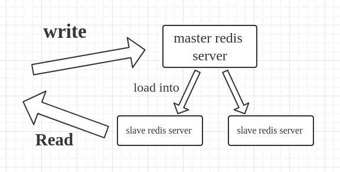

# Redis


Redis is an open-source (BSD licensed), in-memory data structure store, used as a database, cache, and message broker. It supports data structures such as strings, hashes, lists, sets, sorted sets with range queries, bitmaps, hyperloglogs, geospatial indexes with radius queries and streams.

Let’s break the Redis word into 3 parts.

> RE(Remote ) DI(Dictionary ) S(Server)

So Redis is an acronym for the Remote Dictionary server and in a very basic word, Redis is a **key-value store**.

## Key-Value store

Redis server/store that stores data as key-value pair. As an example, "temperature"="23". Here "temperature" is the Key and "23" is the value. Redis can read an write those key-value pairs and can thus be used as a database.

Let us find out how the user interacts with the Redis key-value store.

We can WRITE data to the Redis server using SET "name" "23" and also we can READ data from the server using GET "temperature".

Lets start a Redis server using docker

```shell
docker run --name redis -p 6379:6379 -d redis
```

Now let us start the `redis-cli` in that container to interact with the Redis server

```shell
docker exec -it redis redis-cli
```

```text
127.0.0.1:6379> SET temperature 23
OK
127.0.0.1:6379> GET temperature
"23"
```

The following command can be used to interact and manage key-value pairs

Command | Description
--- | ---
`SET <key> <value>` | Setting a value
`GET <key>` | Get a value
`EXISTS <key>` | Check if a key exist
`DEL <key>` | Delete a key (This is a synchronous blocking operation)
`UNLINK <key>` | Remove items by unlinking them. This is better than the `DEL` command as it free's the memory using a garbage collector later on.
`EXPIRE <key> <seconds>` | Setting a time to expire for a key
`PEXPIRE <key> <milliseconds>` | Setting a time to expire for a key in _milliseconds_
`INCR <key>` | Increment a number
`DECR <key>` | Decrement a number
`INCRBY <key> <value>` | Increment a number with a given value
`DECRBY <key> <value>` | Decrement a number with a given value

All the above mentioned commands just deal with storing and manipulating of string or integer values. There are other data structure values such as hashes, sets, bit arrays, etc. that can be used to solve complex problems.

## Why Redis

* Performance
* Flexibility
* Language Support
* Compatibility
* Durability
* Scaling

### Performance and the Speed

You know now Redis is super fast. But we do not know how fast exactly.

You can benchmark Redis on your machine using the `redis-benchmark` command

```shell
docker exec -it redis redis-benchmark
```

### Simple and Flexible

You know that Redis is a NoSQL data store and we do not need anything to define like tables, rows, and columns. No need for statements. The READ and WRITE data to the Redis server is very very simple and straight forward.

### Durability

How Durable is Redis? In Redis, it although works with the data in memory/cache. But it has the option to write on the disk. And this option is configurable. And also we can use Redis as a Caching system or a full-fledged Database.

### Multi-Language and Platform Support

Here you can find entire languages and clients supported for Reids.

### Compatibility

So one of the major use of Redis is it can be used as a secondary Database for your applications to make transactions faster. Let us look at an example.

### Scaling

Redis has a very good master-slave replication feature. You can use different instances of Redis. Master can be a write-only data store. And also one of the slaves can be used for read-only. And other slaves can be used to write the data to the Disk. It can increase the performance while the master and one of the slaves doing read and write.


