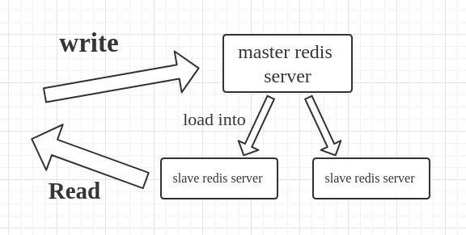

# Redis


Redis is an open-source (BSD licensed), in-memory data structure store, used as a database, cache, and message broker. It supports data structures such as strings, hashes, lists, sets, sorted sets with range queries, bitmaps, hyperloglogs, geospatial indexes with radius queries and streams.

Let’s break the Redis word into 3 parts.

> RE(Remote ) DI(Dictionary ) S(Server)

So Redis is an acronym for the Remote Dictionary server and in a very basic word, Redis is a **key-value store**.

## Key-Value store

Redis server/store that stores data as key-value pair. As an example, "temperature"="23". Here "temperature" is the Key and "23" is the value. Redis can read an write those key-value pairs and can thus be used as a database.

Let us find out how the user interacts with the Redis key-value store.

We can WRITE data to the Redis server using SET "name" "23" and also we can READ data from the server using GET "temperature".

Lets start a Redis server using docker

```shell
docker run --name redis -p 6379:6397 -d redis
```

Now let us start the `redis-cli` in that container to interact with the Redis server

```shell
docker exec -it redis redis-cli
```

```text
127.0.0.1:6379> SET temperature 23
OK
127.0.0.1:6379> GET temperature
"23"
```

The following command can be used to interact and manage key-value pairs

Command | Description
--- | ---
`SET <key> <value>` | Setting a value
`GET <key>` | Get a value
`EXISTS <key>` | Check if a key exist
`DEL <key>` | Delete a key (This is a synchronous blocking operation)
`UNLINK <key>` | Remove items by unlinking them. This is better than the `DEL` command as it free's the memory using a garbage collector later on.
`EXPIRE <key> <seconds>` | Setting a time to expire for a key
`PEXPIRE <key> <milliseconds>` | Setting a time to expire for a key in _milliseconds_
`INCR <key>` | Increment a number
`DECR <key>` | Decrement a number
`INCRBY <key> <value>` | Increment a number with a given value
`DECRBY <key> <value>` | Decrement a number with a given value

All the above mentioned commands just deal with storing and manipulating of string or integer values. There are other data structure values such as hashes, sets, bit arrays, etc. that can be used to solve complex problems.

## Why Redis

* Performance
* Flexibility
* Language Support
* Compatibility
* Durability
* Scaling

### Performance and the Speed

You know now Redis is super fast. But we do not know how fast exactly.

You can benchmark Redis on your machine using the `redis-benchmark` command

```shell
docker exec -it redis redis-benchmark
```

### Simple and Flexible

You know that Redis is a NoSQL data store and we do not need anything to define like tables, rows, and columns. No need for statements. The READ and WRITE data to the Redis server is very very simple and straight forward.

### Durability

How Durable is Redis? In Redis, it although works with the data in memory/cache. But it has the option to write on the disk. And this option is configurable. And also we can use Redis as a Caching system or a full-fledged Database.

### Multi-Language and Platform Support

Here you can find entire languages and clients supported for Reids.

### Compatibility

So one of the major use of Redis is it can be used as a secondary Database for your applications to make transactions faster. Let us look at an example.

### Scaling

Redis has a very good master-slave replication feature. You can use different instances of Redis. Master can be a write-only data store. And also one of the slaves can be used for read-only. And other slaves can be used to write the data to the Disk. It can increase the performance while the master and one of the slaves doing read and write.



## Datatypes

* Strings
* Lists
* Sets
* Hashes
* Sorted sets

### Strings

Strings are the most basic kind of Redis value. Redis Strings are binary safe, this means that a Redis string can contain any kind of data, for instance a JPEG image or a serialized Ruby object.

A String value can be at max 512 Megabytes in length.

You can do a number of interesting things using strings in Redis, for instance you can:

* Use Strings as atomic counters using commands in the `INCR` family: `INCR`, `DECR`, `INCRBY`.
* Append to strings with the `APPEND` command.
* Use Strings as a random access vectors with `GETRANGE` and `SETRANGE`.
* Encode a lot of data in little space, or create a Redis backed Bloom Filter using `GETBIT` and `SETBIT`.

Check [all the available string commands](https://redis.io/commands/#string) for more information.

### Lists

Redis Lists are simply lists of strings, sorted by insertion order. It is possible to add elements to a Redis List pushing new elements on the head (on the left) or on the tail (on the right) of the list.

The `LPUSH` command inserts a new element on the head, while `RPUSH` inserts a new element on the tail. A new list is created when one of this operations is performed against an empty key. Similarly the key is removed from the key space if a list operation will empty the list. These are very handy semantics since all the list commands will behave exactly like they were called with an empty list if called with a non-existing key as argument.

Some example of list operations and resulting lists:

```text
LPUSH mylist a   # now the list is "a"
LPUSH mylist b   # now the list is "b","a"
RPUSH mylist c   # now the list is "b","a","c" (RPUSH was used this time)
```

The max length of a list is 2^32 - 1 elements (4294967295, more than 4 billion of elements per list).

The main features of Redis Lists from the point of view of time complexity are the support for constant time insertion and deletion of elements near the head and tail, even with many millions of inserted items. Accessing elements is very fast near the extremes of the list but is slow if you try accessing the middle of a very big list, as it is an O(N) operation.

You can do many interesting things with Redis Lists, for instance you can:

* Model a timeline in a social network, using `LPUSH` in order to add new elements in the user time line, and using `LRANGE` in order to retrieve a few of recently inserted items.
* You can use `LPUSH` together with `LTRIM` to create a list that never exceeds a given number of elements, but just remembers the latest N elements.
* Lists can be used as a message passing primitive, See for instance the well known Resque Ruby library for creating background jobs.
* You can do a lot more with lists, this data type supports a number of commands, including blocking commands like `BLPOP`.

Please check [all the available commands operating on lists](https://redis.io/commands#list) for more information.

### Sets

Redis Sets are an unordered collection of Strings. It is possible to add, remove, and test for existence of members in O(1) (constant time regardless of the number of elements contained inside the Set).

Redis Sets have the desirable property of not allowing repeated members. Adding the same element multiple times will result in a set having a single copy of this element. Practically speaking this means that adding a member does not require a check if exists then add operation.

A very interesting thing about Redis Sets is that they support a number of server side commands to compute sets starting from existing sets, so you can do unions, intersections, differences of sets in very short time.

The max number of members in a set is 2^32 - 1 (4294967295, more than 4 billion of members per set).

You can do many interesting things using Redis Sets, for instance you can:

* You can track unique things using Redis Sets. Want to know all the unique IP addresses visiting a given blog post? Simply use `SADD` every time you process a page view. You are sure repeated IPs will not be inserted.
* Redis Sets are good to represent relations. You can create a tagging system with Redis using a Set to represent every tag. Then you can add all the IDs of all the objects having a given tag into a Set representing this particular tag, using the `SADD` command. Do you want all the IDs of all the Objects having three different tags at the same time? Just use `SINTER`.
* You can use Sets to extract elements at random using the `SPOP` or `SRANDMEMBER` commands.

As usual, check the [full list of Set commands](https://redis.io/commands#set) for more information.

### Hashes

Redis Hashes are maps between string fields and string values, so they are the perfect data type to represent objects (e.g. A User with a number of fields like name, surname, age, and so forth):

```text
HMSET user:1000 username antirez password P1pp0 age 34
HGETALL user:1000
HSET user:1000 password 12345
HGETALL user:1000
```

A hash with a few fields (where few means up to one hundred or so) is stored in a way that takes very little space, so you can store millions of objects in a small Redis instance.

While Hashes are used mainly to represent objects, they are capable of storing many elements, so you can use Hashes for many other tasks as well.

Every hash can store up to 2^32 - 1 field-value pairs (more than 4 billion).

Check the [full list of Hash commands](https://redis.io/commands#hash) for more information.

### Sorted sets

Redis Sorted Sets are, similarly to Redis Sets, non repeating collections of Strings. The difference is that every member of a Sorted Set is associated with score, that is used in order to take the sorted set ordered, from the smallest to the greatest score. While members are unique, scores may be repeated.

With sorted sets you can add, remove, or update elements in a very fast way (in a time proportional to the logarithm of the number of elements). Since elements are taken in order and not ordered afterwards, you can also get ranges by score or by rank (position) in a very fast way. Accessing the middle of a sorted set is also very fast, so you can use Sorted Sets as a smart list of non repeating elements where you can quickly access everything you need: elements in order, fast existence test, fast access to elements in the middle!

In short with sorted sets you can do a lot of tasks with great performance that are really hard to model in other kind of databases.

With Sorted Sets you can:

* Take a leaderboard in a massive online game, where every time a new score is submitted you update it using `ZADD`. You can easily take the top users using `ZRANGE`, you can also, given a user name, return its rank in the listing using `ZRANK`. Using `ZRANK` and `ZRANGE` together you can show users with a score similar to a given user. All very quickly.
* Sorted Sets are often used in order to index data that is stored inside Redis. For instance if you have many hashes representing users, you can use a sorted set with elements having the age of the user as the score and the ID of the user as the value. So using `ZRANGEBYSCORE` it will be trivial and fast to retrieve all the users with a given interval of ages.

Sorted Sets are probably the most advanced Redis data types, so take some time to check the [full list of Sorted Set commands](https://redis.io/commands#sorted_set) to discover what you can do with Redis!

## Pub/Sub

Redis also supports the PUBLISH and SUBSCRIBE commands, which enable your to do quick messaging and communication between processes.

The way it works is simple:

* `SUBSCRIBE` will listen to a channel
* `PUBLISH` allows you to push a message into a **channel**

Those two commands are all you need to build a messaging system with Redis.

The following command will subscribe to the 'redisChat' channel and will listen to any messages send on that channel.

```text
SUBSCRIBE redisChat
Reading messages... (press Ctrl-C to quit)
```

Publishing messages is as easy as subscribing with the `PUBLISH` command

```text
PUBLISH redisChat "Redis is a great caching technique"
```

## Redis Persistence

Redis is an in-memory database. This means that when you restart the server, or in case of power loss, you lose all the data stored in the RAM.

To prevent dataloss, Redis implements 2 different types of persistence:

* RDB - Redis Database File
* AOF - Append-Only File

### RDB advantages

* RDB is a very compact single-file point-in-time representation of your Redis data. RDB files are perfect for backups.
* RDB is very good for disaster recovery hence the snapshot is a single file.
* RDB maximizes Redis performances as it forks a child process that does the persistence work.
* RDB allows faster restarts with big datasets compared to AOF.

### RDB disadvantages

* RDB is NOT good if you need to minimize the chance of data loss.
* Forking a child process can be time-consuming with large datasets.

### AOF advantages

* More durable than RDP.
* The AOF log is an append-only log, so there are no corruption problems if there is a power outage.

### AOF disadvantages

* AOF files are usually bigger than the equivalent RDB files for the same dataset.
* AOF can be slower than RDB depending on the exact fsyncpolicy. (fsyncpolicy is _every second_ — the default - _every command_ or _never_)
