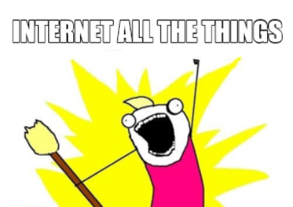

---
---

# IoT Applications

Welcome to the IoT Applications course. In this course we will take a look at the application side concerning Internet of Things applications. Many devices are in one way or another connected to the internet for sharing or gathering information. Connecting devices to the internet means that they can be used and managed from virtually everywhere. This also means that the end users applications are build using web technologies to enable the possibilities that are provided by the internet.

As IoT solutions consist out of many systems working together to build up an application, it impossible to discus and learn all topic in a single course. In this course we will mainly focus on the software side.

* **Frontend and backend development**: As typical IoT applications are not quite that different to classical web applications, we will take a deeper dive into the classical frontend and backend techniques. We will extend these applications using specific IoT technologies and principles. For example in some applications a more efficient communication protocol could be needed to update the application with new values.
* **Data storage and management**: IoT applications might have special requirements on how to handle and store data. Typical relational databases might not be the best fit. In this course will take a look at different ways to store and handle data coming in and out of the application. InfluxDB and Redis are popular databases that have proven to be helpful in an IoT context.
* **Production deployments**: IoT applications can become complex and require a more managed way of deployment and maintenance. Docker is the goto tool that makes deployment easy.
* **Reverse Proxy**: Splitting applications in multiple (micro)services has its benefits for development and maintenance, but make accessibility more cumbersome. Reverse proxy's can help reduce the complexity of making public endpoint to a complex application.

## Project

In the second half of the semester the knowledge of this and previous courses should be transferred into a group project. The projects will try to solve an IoT problem containing devices that communicate using an IoT protocol. Bluetooth Low Energy, LoRaWan, Wifi,... devices will be available for these projects.

[Check out](./projects/hardware/) the available hardware or get some idea's.
Any suggestions or ideas are welcome.

## Lifelong learning

The technology domain in general is an ever changing and evolving domain. What you knew yesterday might not apply anymore, what you know today might not applicable tomorrow. Technology improves all the time. It is impossible to create a single course that covers it all. This course functions only as a **step** to more and other information. This course will provide a solid base to get some understanding in how everything works. Your goals or challenges will quickly surpass what we are able to bring you. Therefore it is important that you learn to gather the information you need for yourself. During the course many pointers to extra sources of learning or information will be provided. Add these sources to your toolbox in order to be successful in the future.

::: quote
Any fool can know. The point is to understand.

::: right
–Albert Einstein
:::

I encourage anyone to play, tinker, hack, experiment, try out new things... This is the easiest way to learn and understand things.

## Contributions

This course is provided on GitHub as an open source project: [github.com/sillevl/course-iot-applications](https://github.com/sillevl/course-iot-applications).

If you want to improve this course simply by correcting _spelling errors_, _improve_ or _add content_, feel free to [contribute](https://github.com/sillevl/course-iot-applications#contributing) by creating [pull requests](https://github.com/sillevl/course-iot-applications/pulls).

If you are not able to make the changes for yourself, feel free to [create an issue](https://github.com/sillevl/course-iot-applications/issues).

## Chapters

1) IoT model
2) Application deployment
   1) Docker
      1) Deploying existing containers
      2) Creating your own containers
3) InfluxDB
4) Grafana
5) Node Express API
   1) REST
   2) OAuth
   3) Database communiction
      1) MySQL
      2) MongoDB
      3) InfluxDB
   4) JWT tokens
6) Vue.js as a framework
   1) Routing with Vue router
   2) Statemanagement with Vuex
   3) PWA
   4) Authentication
   5) JWT
   6) Websockets
7) Redis
8) Reverse proxy with Traefik
  
## Exercises

Under construction

## Assignments

Under construction

## Software

In order to follow the examples and create exercises and challenges, the following software should be installed:

* [git](https://git-scm.com/) ([GitHub](https://github.com/) account, [GitHub SSH keys](https://github.com/settings/keys) configured), [posh-git](https://github.com/dahlbyk/posh-git)
* [Visual Studio Code](https://code.visualstudio.com/) (add context menu integration for files and directories)
* [Node.js](https://nodejs.org/en/) - [TypeScript](https://www.typescriptlang.org/)
* Browser ([Chrome](https://www.google.com/intl/nl/chrome/), [Firefox](https://www.mozilla.org/nl/firefox/new/), ...)
* [Windows Terminal](https://www.microsoft.com/en-us/p/windows-terminal/9n0dx20hk701?activetab=pivot:overviewtab)
* [Windows Subsystem for Linux - WSL 2](https://docs.microsoft.com/en-us/windows/wsl/install-win10) - [Ubuntu](https://www.microsoft.com/en-us/p/ubuntu-2004-lts/9n6svws3rx71?activetab=pivot:overviewtab)
* [Docker for Windows](https://docs.docker.com/docker-for-windows/install/) - [Docker integration for WSL2](https://docs.docker.com/docker-for-windows/wsl/)

## Organization

This course will be organized in multiple different ways:

* **On campus sessions**: Mostly theory is given. These sessions are scheduled in the class schedule and take place at the campus.
* **Online sessions**: Mostly theory is given. These sessions are scheduled in the class schedule and can be followed at home online.
* **Independent learning**: Theory that must be processed individually at your own pace. Mostly with a deadline.
* **On campus exercising sessions**: Sessions that are scheduled in the class schedule that will focus on the practical side of the course. Many exercises and challenges will be given to process at your own pace or with a deadline. This is the perfect moment to ask questions and get feedback.
* **Independent exercising**: Time to continue the challenges and exercises that are provided during the on campus exercising sessions.

## Course Evaluation

For this course you are evaluated in 2 different ways:

* 50% **Written exam**: Examination in the dedicated examination period in January.
* 50% **Permanent evaluation**: Process and exercise evaluation during the semester. Important: For this part, only 1/3th of the scores can be retaken!

For more information and the official details, please read the courses ECTS document.
